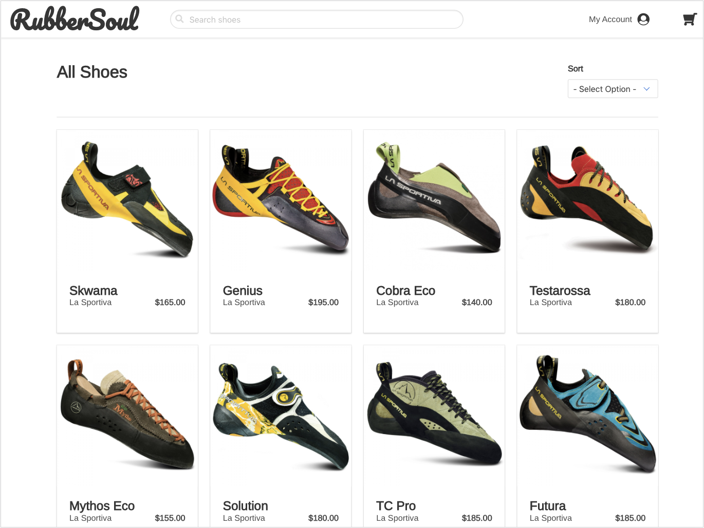
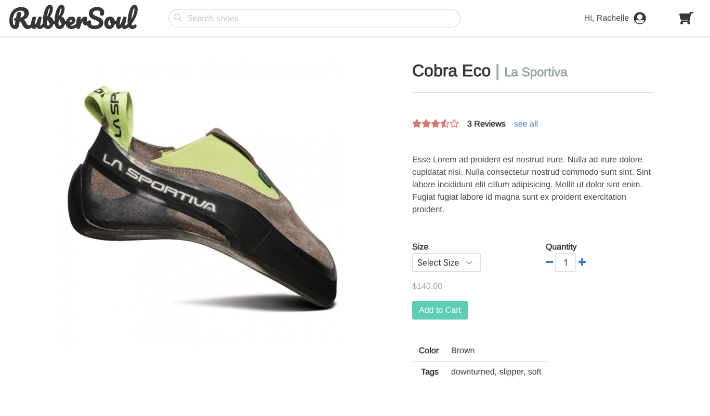
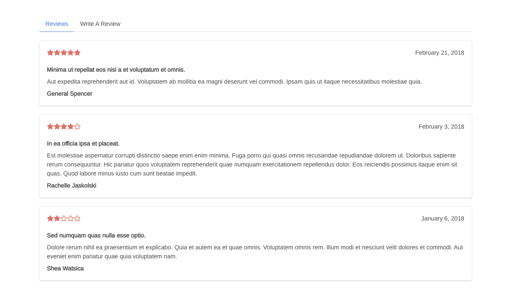
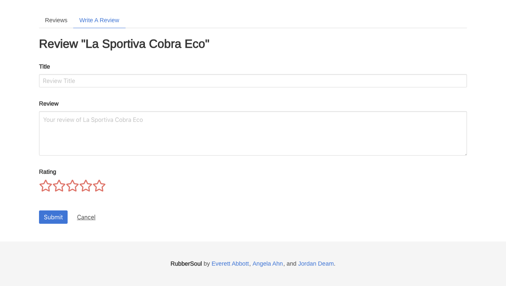
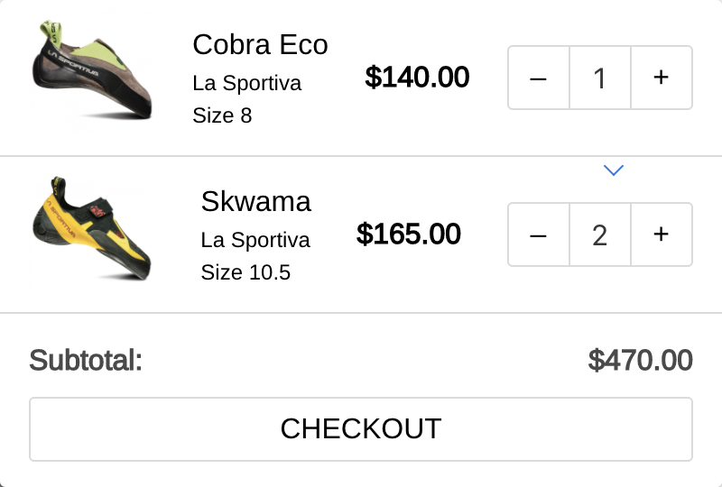
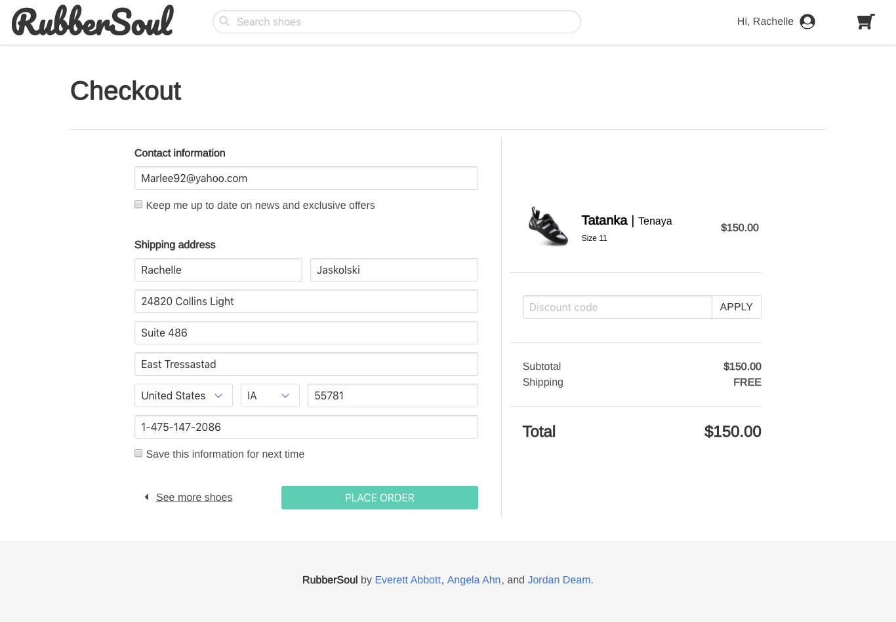

# RubberSoul

*Authors: [Everett Abbott](https://github.com/AbbottEverett "Everett Abbott's GitHub"), [Angela Ahn](https://github.com/aahn84 "Angela Ahn's GitHub"), and [Jordan Deam](https://github.com/jdeam "Jordan Deam's GitHub")*

Rubber Soul is an e-commerce site for popular rock climbing shoes. It allows users to search and filter available shoes, and sign up or login to purchase a shoe. Once authenticated, users can add, remove, and checkout items from their cart, as well as submit shoe reviews.

RubberSoul was built in 1.5 weeks.

### Live URL: http://rubbersoul.surge.sh/
#### Frontend GitHub: https://github.com/jdeam/rubber-soul-frontend
#### Backend GitHub: https://github.com/AbbottEverett/rubber-soul-backend

## Features
- Managed state through React Redux store
- Dynamic search and filter
- Send and retrieve authenticated data from server using REST API

## Technologies
#### Frontend
- React.js
- React Redux
- React Router
- JSX
- JavaScript
- AJAX/axios

#### Backend
- PostgreSQL
- Authentication
- Knex.js
- Node.js
- Express.js
- REST API
- JavaScript

## Screenshots
### Product List:

### Product Detail View:

### Cart/Checkout:

